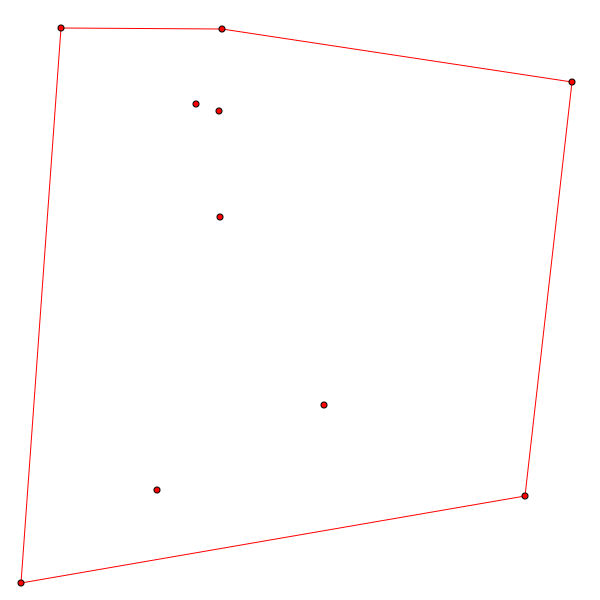
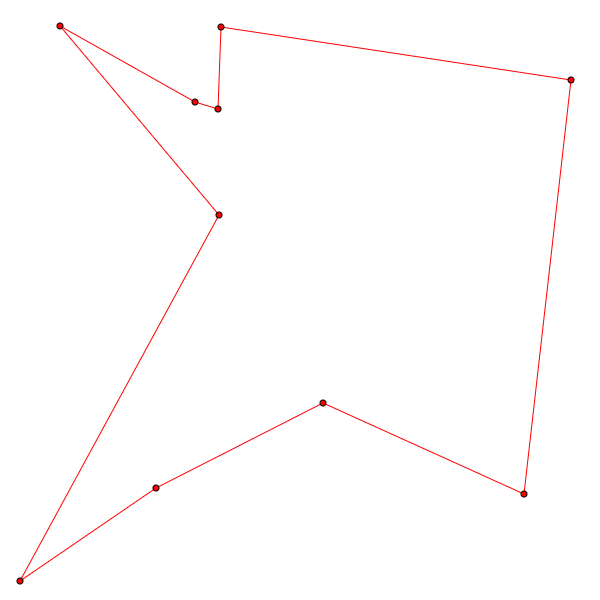
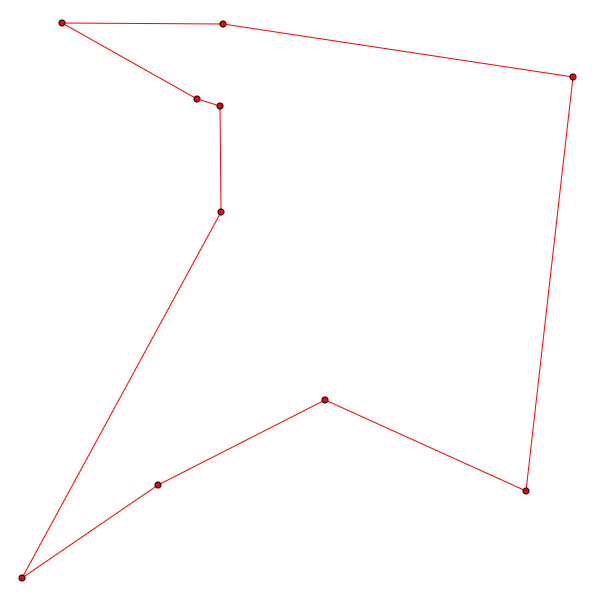
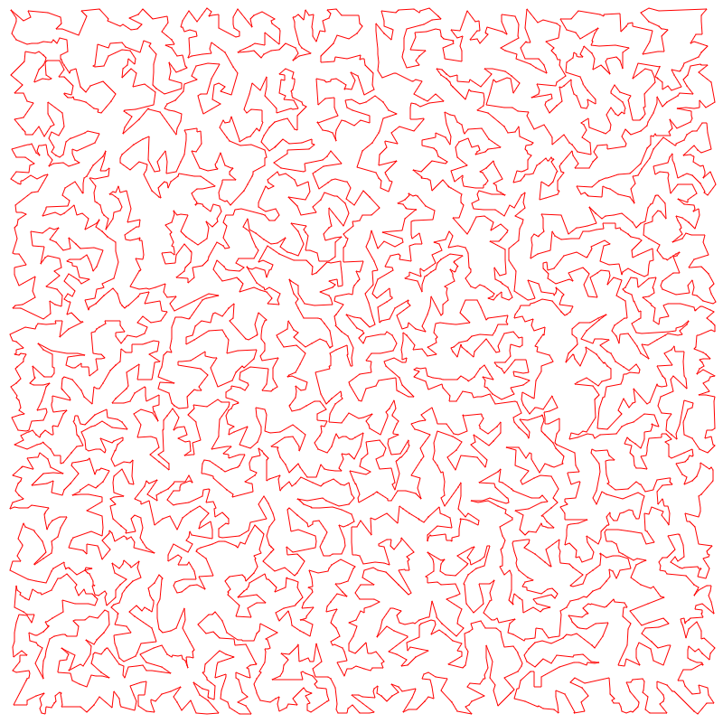

# Travelling Salesman Problem in Euclidean Space

This is my approach to the Euclidean variation of this classical problem, made as a response to the challenge thrown at me by my bro.
The solution leaves several opens for further optimizations.
It is unoptimal for sure; I wrote it having very little prior knowledge on the problem, just for pure fun.

## Problem Statement

There are `N` distinct points (vertices) in the 2-dimenional Euclidean space.
Their coordinates are integral numbers: `[int, int]`.

The task is to find a **closed polygonal chain** spanning over all the vertices, with the possibly shortest overall length.

## Input

The first line contains the number of vertices `N : int`.
The following `N` lines contain `x:int y:int` coordinates of the vertices.

Example from file `data/set10-b.txt`:
```
10
-23 211
336 242
-20 300
-86 -204
-46 218
84 -111
-22 94
-183 301
288 -211
-224 -306
```


## Algorithm

The algorithm starts with the initial **trail** formed as a convex hull embracing all the points.



Having that, the algorithm iteratively includes the enclosed points one by one, greedily extracting the one with the least **cost of inclusion** to any of the current trail's edge, minimalizing the trail length increase.



Trail length: **2392.426379**

After this phase, all the points are a part of a single closed trail (loop).
However, it this state the solution is sub-optimal and can be optimized further.
For example, edges may intersect, which always manifests sub-optimality.
Therefore, several optimization phases take place, which try to swap **a pair of edges**, only if it leads to a better (shorter) trail.



Now the trail length is **2321.142825**.
In this case, an another attempt to optimize the trail is made, but yields no gain, so the algorithm stops.

This is how the solution looks like for a set of 5000 vertices from file `data/set5k.txt`:



The program is able to process 250 000 vertices, but it takes several hours to complete.

## Further Reading

Follow an [outstanding article on Wikipedia](https://en.wikipedia.org/wiki/Travelling_salesman_problem) on the problem and its history.
